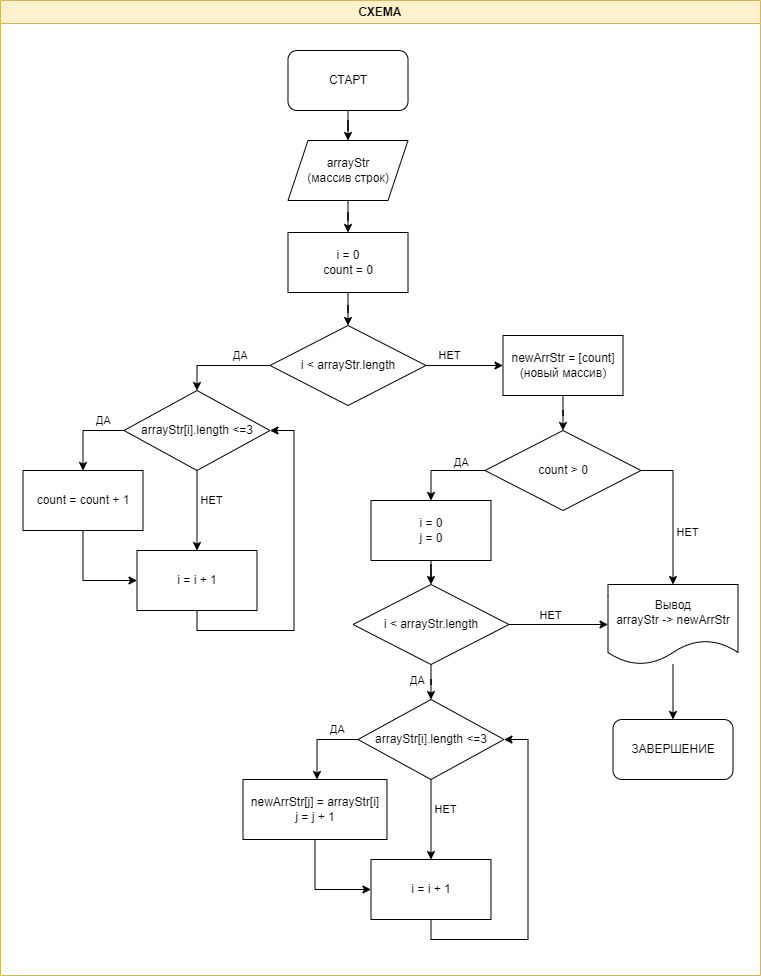

# Задача:

Написать программу, которая из имеющегося массива строк формирует новый массив из строк, длина которых меньше, либо равна 3 символам. Первоначальный массив можно ввести с клавиатуры, либо задать на старте выполнения алгоритма. При решении не рекомендуется пользоваться коллекциями, лучше обойтись исключительно массивами.

# Примеры:

```c#
["Hello", "2", "world", ":-)"] → ["2", ":-)"]
["1234", "1567", "-2", "computer science"] → ["-2"]
["Russia", "Denmark", "Kazan"] → []
```

# Решение

1. Инициализируем массив строк (`arrayStr`).

2. Вводим переменную, в которой будет сохранятся количество строк, длина которых `<= 3` символа (`count`).

3. Перебираем элементы массива в цикле и проверяем каждый на соответствие условию: длина элемента `<= 3` символа.

4. Если условие выполняется, то увеличиваем `count` на 1.

5. Создаём новый массив для строк, удовлетворяющих условию задачи (`newArrStr`). Длина массива = `count`.

6. Если `count > 0`, то в цикле заполняем новый массив (`newArrStr`) значениями из исходного (`arrayStr`), которые удовлетворяют условию задачи.

7. Выводим в терминале исходный массив и получившийся новый массив.

# Блок-схема

